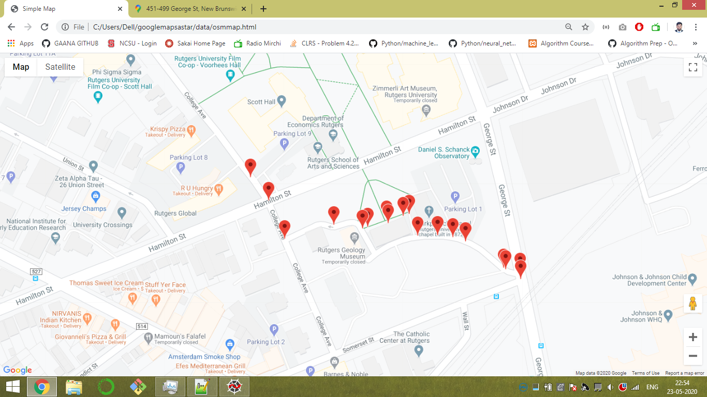
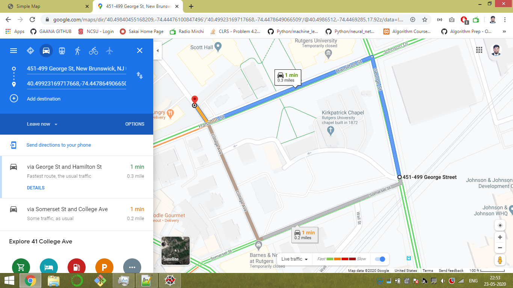

# Project: A* algorithm on google maps to find shortest path (googlemapsastar)
__Data:__
* Data has been extracted from [OSM](https://www.openstreetmap.org/).  
* I have extracted data containing ~27k nodes and ~63k edges)  
* _Bounded by :- min: (40.4961000, -74.5015000); max: (40.5333000, -74.4143000)_  
* More on data:
  * Data provided by OSM is in __.osm__ format, which is nothing but the XML file. 
  * Converted this file to lighter XML _(.graphml)_ file, which can be parsed easily as compared to .osm. [Code](https://github.com/vraj152/googlemapsastar/blob/63c0d686ee192ef10623a42097e52e07cf7f28ab/preprocessingGraph.py#L4)  
  * Used OSMNX for this -> [OSMNX Documentation](https://osmnx.readthedocs.io/en/stable/osmnx.html#osmnx.core.graph_from_file)  
  * This .graphml file will be used for rest of the tasks.  
  * [convertJSON.py](https://github.com/vraj152/googlemapsastar/blob/63c0d686ee192ef10623a42097e52e07cf7f28ab/convertJSON.py) is helper class which contains all the methods which we will be needed to achieve the task.  
    - [getLatLon](https://github.com/vraj152/googlemapsastar/blob/63c0d686ee192ef10623a42097e52e07cf7f28ab/convertJSON.py#L13) - to get latitude and longitude of a node by passing its OSMId.  
    - [getOSMId](https://github.com/vraj152/googlemapsastar/blob/63c0d686ee192ef10623a42097e52e07cf7f28ab/convertJSON.py#L22) - to get OSMId of the node from its latitude and longitude.  
    - [calculateHeuristic](https://github.com/vraj152/googlemapsastar/blob/63c0d686ee192ef10623a42097e52e07cf7f28ab/convertJSON.py#L32) - gives heuristic value from the given node to destination.  
      - Heuristic used:- __Haversine__ (also called as "As crow flies" distance.)  
    - [getNeighbours](https://github.com/vraj152/googlemapsastar/blob/63c0d686ee192ef10623a42097e52e07cf7f28ab/convertJSON.py#L35) - it generates all the neighbours of the given node(given its OSMId).
    - [getNeighbourInfo](https://github.com/vraj152/googlemapsastar/blob/63c0d686ee192ef10623a42097e52e07cf7f28ab/convertJSON.py#L60) - helper function to extract informtation of the particular neighbour while implementing A*.
    - [getKNN](https://github.com/vraj152/googlemapsastar/blob/63c0d686ee192ef10623a42097e52e07cf7f28ab/convertJSON.py#L75) - it finds K-Nearest Neighbour(s) of particular node (given its coordinates).
      - Why do we need it?:- 
        - Application allows users to select any marker on map. So, there might be case that marker selected by user is not present in nodes of our _.graphml_ file. So, in order to make algorithm work - I have used [KD Tree library from sklearn](https://scikit-learn.org/stable/modules/generated/sklearn.neighbors.KDTree.html#sklearn-neighbors-kdtree)  
        - The first index of the output given by _KDTree_ is the most nearest node to the given node.   _for example:_ if we were to find nearest neighbour of the point (40.48834484237183,-74.4464808486693), which is not there in our .osm file. Then output will be [0.00662018 0.00676685 0.00680585] and  first index of the output is nearest and corresponding node is (40.492516, -74.4413367).
    - [getResponsePathDict](https://github.com/vraj152/googlemapsastar/blob/63c0d686ee192ef10623a42097e52e07cf7f28ab/convertJSON.py#L91) - helper function in order to get the final path from source to destination.

__Algorithm: A*__

__UI:__

* Used [Google Maps API](https://developers.google.com/maps/documentation) to render the map. Also map is bounded by the co-ordinates using which OSM map data was generated.
* You can click anywhere on the map. The first mouse event recorded will be treated as __Source__ and second will be __Destination__.
* In order to generate output - click anywhere on the map. It will call the [API](https://github.com/vraj152/googlemapsastar/blob/63c0d686ee192ef10623a42097e52e07cf7f28ab/flaskAPI.py#L11) developed using Flask.
* Path will be displayed by marker with "drop" animation.

__Output:__

* Due to larger number of nodes present in a map-snippet, A* becomes really slow. As it highly depends on branching factor : __O(b^d)__ 
* Hence, it works really well when source and destination are placed nearby.
* Consider below example:
  * Source: (40.49840455168209, -74.44476100847496)
  * Destination: (40.49923169717668,-74.4478649066509)
    * Output generated by Google Maps: Cost:- 0.4828 km (0.3 mi)
    * Output generated by A*: Cost:-  0.337249 km

  
  

* Time taken: ~9 seconds. Pretty Good. :bowtie:

P.S. : Hit me up if you have any doubt.
